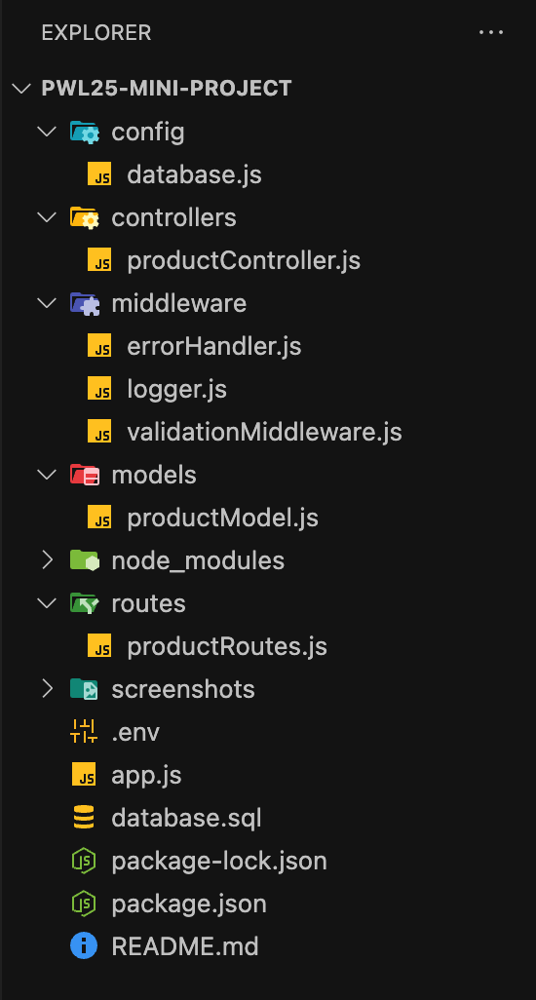
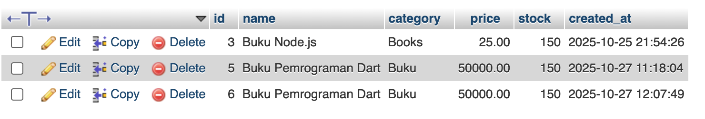
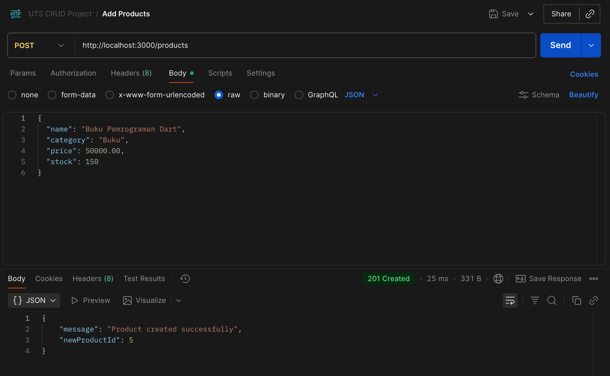
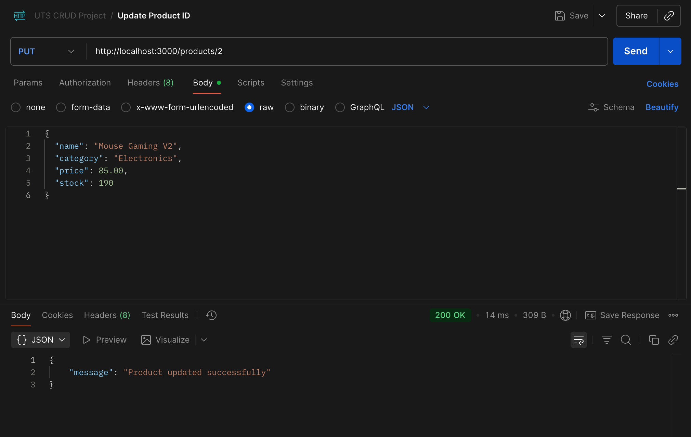
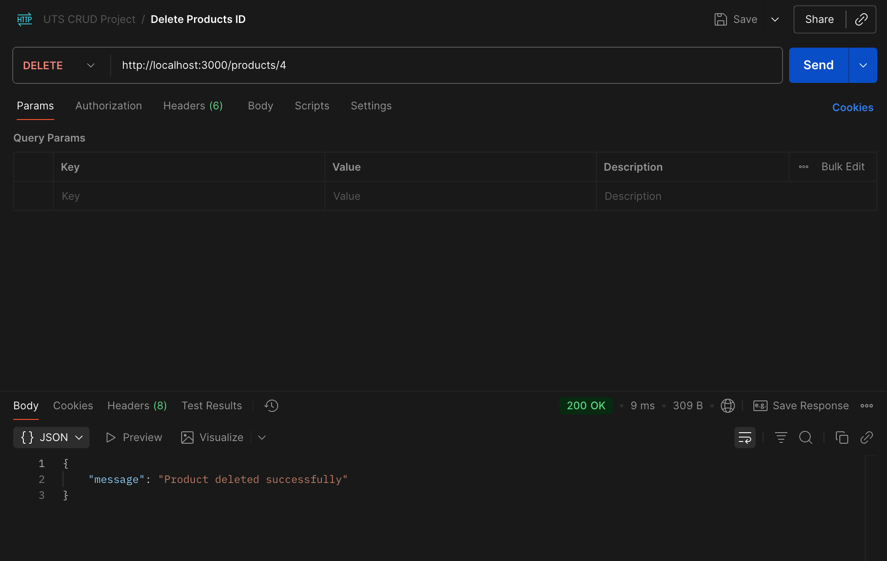

# pwl25-mini-project - Products REST API (CRUD)
Nama: [M. Bayu Aji]
NIM: [F1D02310144]

## Ringkasan Proyek
Repository ini adalah submission Mini Project UTS yang mengimplementasikan sebuah REST API untuk manajemen data produk. Proyek ini dibangun menggunakan Node.js dan Express.js, dengan MySQL sebagai database. Arsitektur yang diterapkan mengikuti pola MVC (Model-View-Controller) dan mencakup middleware esensial untuk logging, validasi, dan error handling.

## Struktur Folder Proyek
Struktur folder mengadopsi pola MVC (Model, Controller, Routes) yang dipadukan dengan folder untuk Config dan Middleware. 

## Database
Saya menggunakan database MySQL dengan nama femalehijab dan satu tabel bernama produk.

## Penjelasan Kode Utama
Berikut adalah penjelasan singkat untuk setiap file berdasarkan kode yang Anda berikan:
1. Entry Point (app.js): Ini adalah file utama yang menginisialisasi server Express. File ini mendaftarkan middleware global (seperti express.json() dan logger) dan mengarahkan semua traffic dari /api/produk ke router yang sesuai.

2. Routing (routes/productRoutes.js): File ini memetakan setiap endpoint HTTP (seperti GET /:id atau POST /) ke fungsi controller yang relevan.

3. Middleware (middleware/*.js):

logger.js: Mencatat setiap request yang masuk (METHOD URL) ke konsol untuk debugging.

validateProduct.js: Mencegat request POST dan PUT. Middleware ini memastikan field wajib (misal: nama_produk, harga) ada di req.body. Jika tidak, ia akan mengirimkan respons 400 Bad Request dan menghentikan proses.

4. Controller (controllers/productController.js): Bertindak sebagai "jembatan". Controller mengambil request (misal req.params.id atau req.body), memanggil fungsi model yang sesuai untuk berinteraksi dengan database, dan akhirnya memformat serta mengirimkan respons JSON kembali ke client.

5. Model (models/productModel.js): Ini adalah lapisan akses data. Semua query SQL murni (seperti SELECT *, INSERT INTO, UPDATE, DELETE) ditulis di sini. Fungsi di model dipanggil oleh controller.

6. Konfigurasi (config/db.js): Menyediakan koneksi database yang aman (menggunakan mysql2/promise) untuk digunakan oleh model. Konfigurasi ini mengambil kredensial sensitif (host, user, password) dari file .env.

7. Error Handling (middleware/errorHandler.js): Sebagai middleware penampung terakhir, errorHandler.js akan menangkap error server yang tidak terduga (HTTP 500), mencatatnya, dan mengirimkan pesan error yang standar ke client.

## Implementasi Middleware Wajib
•⁠  ⁠logger (middleware/logger.js): Mencatat setiap request yang masuk (METHOD URL) ke konsol server.
•⁠  ⁠validateProduct (middleware/validateProduct.js): Memastikan field wajib (nama_produk, kategori, harga, stok, tanggal_masuk) terisi sebelum operasi POST atau PUT dilanjutkan. Jika gagal, mengembalikan HTTP 400.
•⁠  ⁠errorHandler (middleware/errorHandler.js): Middleware terakhir untuk menangkap error yang tidak terduga dan mengembalikan response HTTP 500 yang seragam.

## Hasil Uji API dengan Postman
Pengujian endpoint dilakukan menggunakan Postman untuk memverifikasi fungsionalitas CRUD:

1. GET /api/produk (Ambil Semua): Berhasil mengambil seluruh daftar produk dari database dan mengembalikannya sebagai array 

2. GET /api/produk/1 (Ambil per ID): Berhasil mengambil data spesifik untuk produk dengan ID 2. 

3. POST /api/produk (Buat Baru): Berhasil menambahkan produk baru menggunakan body JSON. Server merespons dengan status 201 Created dan data produk yang baru dibuat. 

4. PUT /api/produk/1 (Update): Berhasil memperbarui data produk ID 2. Body request berisi data baru, dan server merespons dengan status 200 OK serta data yang telah diperbarui. 

5. DELETE /api/produk/2 (Hapus): Berhasil menghapus produk dengan ID 4. Server merespons dengan status 200 OK dan pesan konfirmasi penghapusan. 

